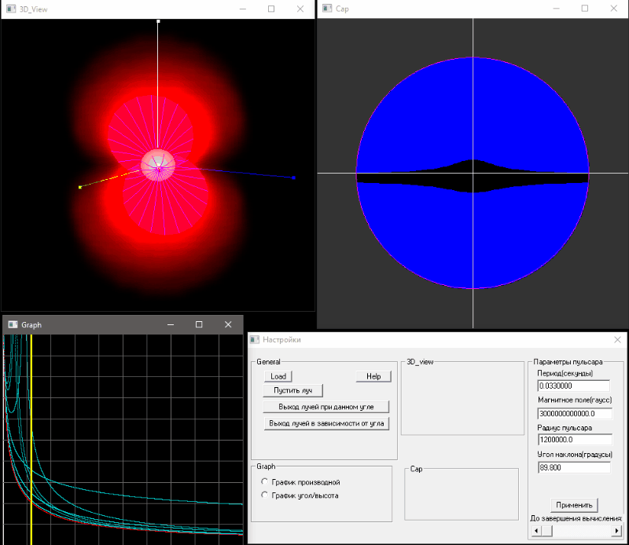

# 2006_WIN32_pulsar_magnitosphere_modelling
Visualization of the plasma distribution and simulation of the electromagnetic wave propagation in the pulsar magnetosphere/

The program is written for the Windows platform (32 bits, WinXP and older) in C++. To work with windows and system calls, the Win32 API is used, 3D graphics are implemented through OpenGL.

* Read in other languages: [English](README.md), [Russian](README.ru.md)

Screenshots:

# Table of contents
- [Installation](#Installation)
- [Short description](#Short-description)
- [Link to the publication](#Link-to-the-publication)

# Installation

To use the program, just download the Pulsar.zip file, unpack the archive and run Pulsar.exe, modern Windows versions are supported.

To compile from source (code folder), you must use the C++ compiler from Visual Studio.

# Short description

The upper left window shows a view of a neutron star (pulsar) with the current parameters (the magnetic field on the star's surface, the rotation period, the angle between the rotation axis and the magnetic axis, the radius of the neutron star).
The white sphere is the star itself, the density of the electric charge of the plasma in the closed part of the pulsar magnetosphere is marked in red (it's proportional to the Goldreich-Julian density, i.e. such a density that completely shields electric field formed due to the rotation of the star), the conus of the open magnetic field lines is shown in purple - i.e. limiting magnetic field lines forming a closed part of the pulsar's magnetosphere. Those part of the magnetosphere the plasma in which is capable of solid-state rotation together with the star (i.e. the linear speed of rotation of plasma particles is less than the speed of light).
The upper right window shows a view of the polar cap of the pulsar and the boundary along which the vacuum gap passes. In the blue region, there is a gap with an uncompensated electric field of sufficient height
in order to accelerate the particle to the energy required for the emission of a bending photon with an energy sufficient to produce an electron-positron pair. Accordingly, a secondary electron-positron plasma will be constantly born in the blue region, and an electromagnetic wave that has arisen at a low altitude in the region of the polar cap will not be able to leave this region and reach the observer. In the black region, the plasma density is much lower, and the propagation of electron waves is possible.
The program, in addition to visualization, calculates the trajectories of electromagnetic waves that can leave the pulsar's magnetosphere and reach the observer.

# Link to the publication

The results obtained using this program formed the basis of the study described in the article:

A. S. Andrianov, V. S. Beskin "Limiting polarization effect—a key link in investigating the mean profiles of radio pulsars" Astronomy Letters volume 36, pages 248–259 (2010)

DOI:10.1134/S1063773710040031

[Read](https://link.springer.com/article/10.1134/s1063773710040031)
