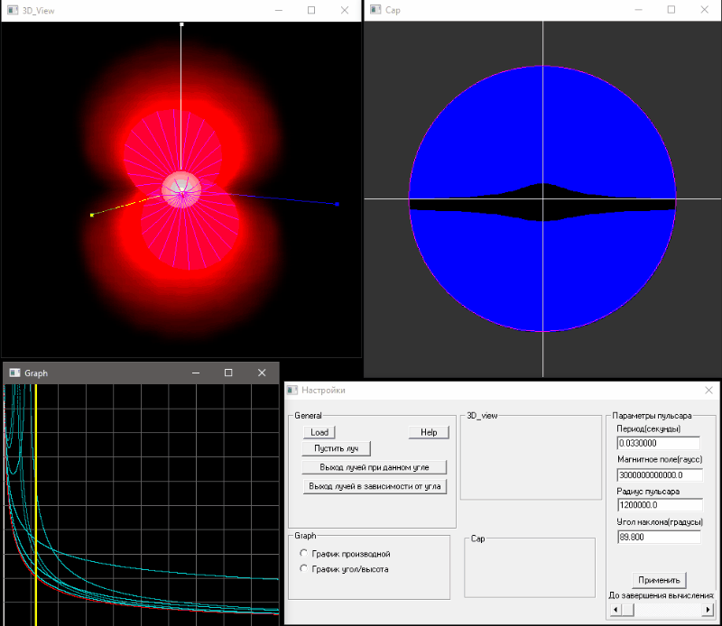

# 2006_WIN32_pulsar_magnitosphere_modelling
Визуализация распределения плазмы и моделирование распространения электромагнитных волн в магнитосфере пульсара

Программа написана для платформы Windows (32 бита, WinXP и старше) на языке С++. Для работы с окнами и системными вызовами используется Win32 API, 3D графика реализована через OpenGL.

* Читать на других языках: [English](README.md), [Русский](README.ru.md)

Скриншоты:

# Оглавление
- [Установка](#Установка)
- [Краткое описание](#Краткое-описание)
- [Ссылка на публикацию](#Ссылка-на-публикацию)

# Установка

Для использования достаточно скачать файл Pulsar.zip, распаковать архив и запустить Pulsar.exe, современные версии windows поддерживаются.

Для компиляции из исходников (папка code) необходимо использовать компилятор С++ из Visual Studio.

# Краткое описание

В левом верхнем окне показан вид нейтронной звезды-пульсара с текущими параметрами (задаются магнитное поле на поверхности звезды, период вращения, угол между осью вращения и магнитной осью, радиус звезды). 
Белый шар - сама звезда, красным цветом отмечена плотность электрического заряда плазмы в закрытой части магнитосферы пульсара (пропорциональная плотности Гольдрейха-Джулиана, т.е. такая плотность, которая полностью экранирует
образуемое из-за вращения звезды электрическое поле), фиолетовым показан косус открытых силовых линий - т.е. предельные линии магнитного поля, образующие закрытую часть магнитосферы пульсара. Т.е. такую часть магнитосферы, 
плазма в которой способна твердотельно вращаться вместе со звездой (т.е. линейная скорость вращения частиц плазмы менее скорости света).
В правом верхнем окне показан вид полярной шапки пульсара и граница по которой проходит вакуумный зазор. В синей области существует зазор с незаэкранированным электрическим полем достаточной высоты 
для того чтобы ускорить частицу до энергии, необходимой для рождения электрон-позитронной пары, соответственно в синей области будет постоянно рождаться вторичная электрон-позитронная плазма и электромагнитная волна,
возникшая на небольшой высоте, не сможет выйти из этой области и дойти до наблюдателя. В черной области плотность плазмы существенно ниже, и распространение электронагнитных волн возможно.
Программа помимо визуализации расчитывает траектории движения электромагнитных волн, способных покинуть магнитосферу пульсара и дойти до наблюдателя. 

# Ссылка на публикацию

Результаты, полученные при помощи данной программы легли в основу исследования, описанного в статье

A. S. Andrianov, V. S. Beskin "Limiting polarization effect—a key link in investigating the mean profiles of radio pulsars" Astronomy Letters volume 36, pages 248–259 (2010)

DOI:10.1134/S1063773710040031

[Читать](https://link.springer.com/article/10.1134/s1063773710040031)

